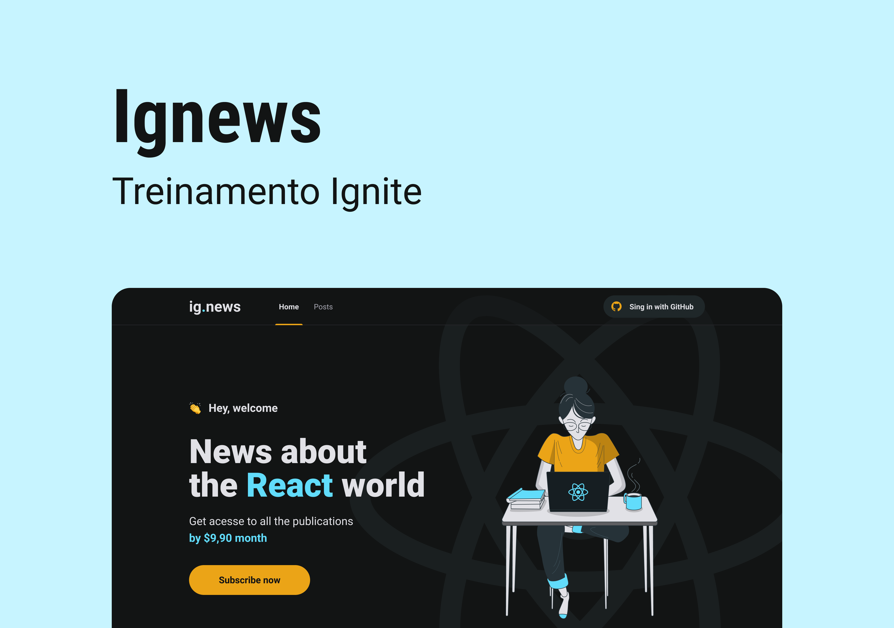

<p align="center">
  
</p>

## **💻** Projeto

Ignews foi desenvolvido durante o programa de aceleração “Ignite  - ReactJS”, promovido pela Rocketseat, onde foi desenvolvido uma interface de blog onde os usuários podem ter acesso ao conteúdo de cada postagem de acordo com o status de sua assinatura. O blog é um Headless, ou seja, o novo conteúdo gerado pela plataforma PrismicCMS é renderizado para o usuário em tempo real, possuindo ainda um sistema de compra integrado com o STRIPE, e após o usuário realizar o pagamento, sua inscrição estará ativa e pronta para visualizar o conteúdo completo de todo o blog. Caso o usuário não deseje optar pela assinatura, ele terá acesso limitado ao conteúdo das postagens. E todos os dados necessários para se fazer verificações de assinaturas ou dados dos usuários, estão salvos no banco de dados FaunaDB.
Essa é uma aplicação Serverless, ou seja, todo o processo que dependeria de um backend foi integrado dentro do front e seguindo o padrão da JAMStack. 

<p align="center">
  
</p>

## 🚀 Tecnologias

As seguintes tecnologias foram utilizadas no projeto:

- [Next.js](https://nextjs.org/)
- [ReactJS](https://reactjs.org/)
- [Next-auth](https://next-auth.js.org/)
- [Jest](https://jestjs.io/pt-BR/)
- [Prismic CMS](https://prismic.io/)
- [Stripe](https://stripe.com/)
- [FaunaDB](https://fauna.com/)

## **🔖** Layout

Você pode visualizar o layout do projeto através do link abaixo:

- [Figma Layout](https://www.figma.com/file/BdeVVWMBNtRLlffBupMSqo/ig.news-(Copy)?node-id=3%3A7&t=ajI1i0wc4eyvCVFh-0)

Lembrando que você precisa ter uma conta no [Figma](http://figma.com/).

## **🚀** Como Executar

PS: é necessário ter o [NodeJS](https://nodejs.org/en/) e o [Git](https://git-scm.com/) instalados em sua máquina, antes de realizar os códigos abaixo:

```bash
## Clone o projeto em sua máquina
git clone [https://github.com/srsouzaj/](https://github.com/srsouzaj/nlwsetup)ignews.git

# Acessar o projeto no terminal
$ cd ignews

# Instalar as dependências
$ npm install

# Executar o servidor em modo de desenvolvimento
$ npm run dev
```

## 📝 License

Esse projeto está sob a licença MIT. Veja o arquivo [LICENSE](https://github.com/srsouzaj/ignews/blob/main/LICENSE.MD) para mais detalhes.

Feito com ❤️ por Jorge de Souza
